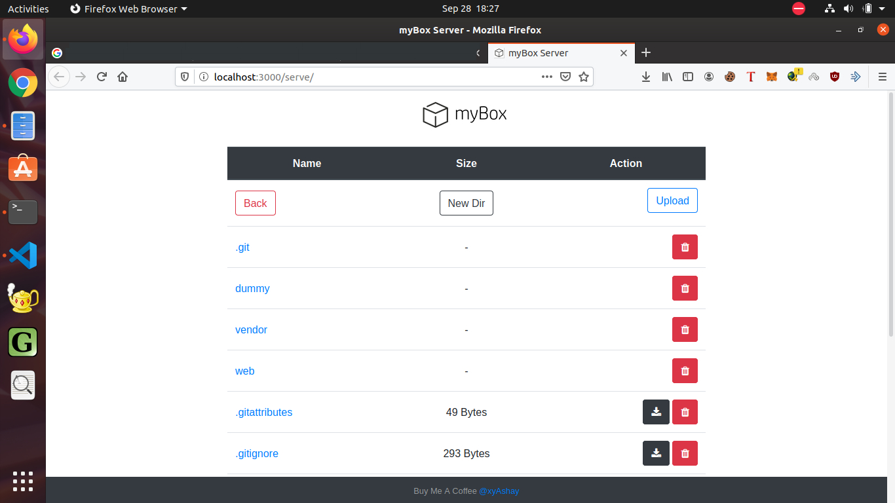

<h1 align='center'>myBox</h1>

**Update [Dec 2019]** : Project has been discontinued due to a bug in the dependencies causing the app to keep bandwidth utilized more than requirements.

<p align='center'>
    
</p>

<div align= "center">
  <h4>
    A file server designed to provide persistent storage and availability of data to resemble a network level cloud server.
  </h4>
</div>

<br/>

## Concept
myBox opens up a port on the network and utilizes it for two-way transfer of data to/from the server system and the connected devices in the network.

The devices can interact with the server using the provided web framework to send and receive data. All the data sent to the server in stored on the local disc.

<br/>

## Usage

To start the server run:
```bash
     go run .
```

<br/>

## Screens
<p align='center'>
    
</p>